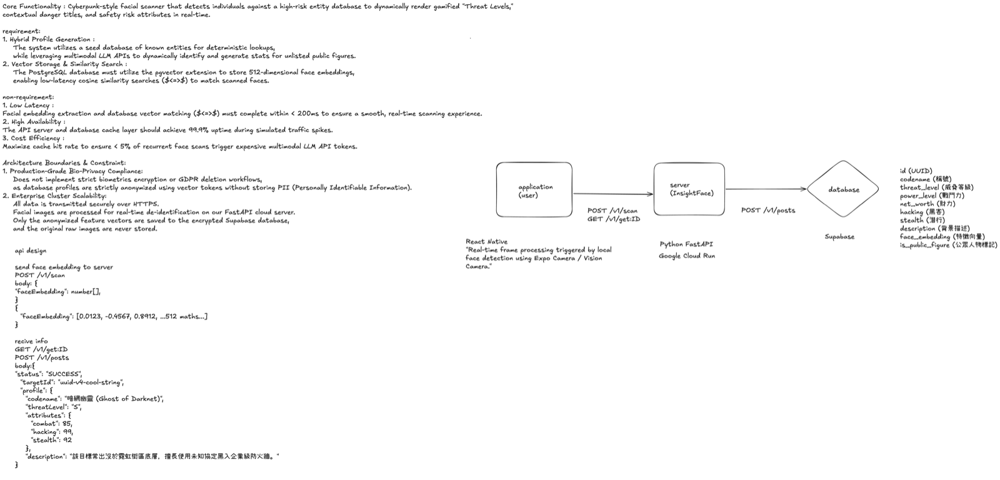

# 🎯 BountyFace

[English](#english) | [繁體中文](#繁體中文)

---

## Project structure

* Frontend: [frontend](frontend)
* Backend: [backend](backend)
* Design chart: [systemDesignChart.png](systemDesignChart.png)

## System design chart



---

## English

Cyberpunk-style facial scanner that detects individuals against a high-risk entity database to dynamically render gamified "Threat Levels," contextual danger titles, and safety risk attributes in real-time.

### 1. Core Philosophy: Privacy-First Ephemeral Image Processing

In this field mission, your mobile device acts as an advanced Cyber-Scanner. **BountyFace** extracts 512-dimensional face feature vectors directly on the local device and uses them as the primary identity-matching token.

For existing targets, only the face embedding is transmitted to the backend for similarity search. When a new target is detected, a single captured scan image may be temporarily uploaded to the backend for gameplay attribute analysis. The image is processed in memory and immediately discarded after analysis. No raw image is stored in the database or any persistent storage.

### 2. Tech Stack

* **Frontend:** React Native (Expo SDK 52 / Architecture 22) - Handles real-time camera frame processing, face detection, pose/person scanning, and local biometric tokenization.
* **Backend:** Python FastAPI (Deployed on Google Cloud Run) - Lightweight orchestration layer for managing identity matching, temporary gameplay analysis, and game-logic verification.
* **Database:** Supabase (PostgreSQL) with `pgvector` & HNSW indexing - Secures and indexes mathematical feature embeddings with sub-millisecond retrieval.

### 3. Architecture Boundaries & Constraints

* **Privacy-First Biometric Processing:**
  Face embeddings are extracted on the local device and used as the primary identity-matching token. For existing targets, only the embedding is transmitted to the backend. When a new target is detected, a single captured image may be temporarily uploaded for gameplay attribute analysis. The image is processed in memory and immediately discarded. No raw image is stored in the database or persistent storage.

* **Zero Persistent Image Storage:**
  When a new target is detected, a single captured image may be temporarily uploaded to the backend for gameplay attribute analysis. The image is processed in memory and immediately discarded after analysis. Only the generated face embedding and game profile are permanently stored.

* **Lightweight Single-Instance Architecture:**
  To keep the architecture lean and cost-efficient, this project deliberately avoids heavy, distributed vector databases (e.g., Milvus, Qdrant) or complex cluster load-balancing. Instead, a single-instance PostgreSQL database equipped with HNSW indexing (via Supabase `pgvector`) is utilized, providing sub-millisecond retrieval speeds that perfectly match the game's sandbox volume.

### 4. API Design

#### Existing Target Flow

```text
Camera
→ Face detected
→ Generate face embedding locally
→ POST /v1/scan
→ Match found
→ GET /v1/targets/{targetId}
```

#### New Target Flow

```text
Camera
→ Face detected
→ Generate face embedding locally
→ POST /v1/scan
→ No match found
→ Capture one scan image
→ POST /v1/targets/generate
→ Analyze image temporarily
→ Save face embedding + generated profile only
```

---

### Send face embedding to server

`POST /v1/scan`

Request body:

```json
{
  "faceEmbedding": [0.0123, -0.4567, 0.8912]
}
```

If the same face embedding exists in the database:

```json
{
  "status": "SUCCESS",
  "matchFound": true,
  "targetId": "uuid-v4-cool-string",
  "message": "Target identified successfully."
}
```

If the face embedding does not exist in the database:

```json
{
  "status": "SUCCESS",
  "matchFound": false,
  "targetId": "uuid-v4-new-generated-string",
  "message": "New face detected. Please generate a profile."
}
```

---

### Receive target profile

`GET /v1/targets/{targetId}`

Response:

```json
{
  "status": "SUCCESS",
  "profile": {
    "id": "uuid-v4-cool-string",
    "codename": "黑曜石",
    "threat_level": "S",
    "power_level": 9000,
    "net_worth": 50000000,
    "hacking": 85,
    "stealth": 90,
    "description": "該目標常出沒於霓虹街區底層，擅長使用未知協定黑入企業級防火牆。",
    "is_public_figure": false
  }
}
```

---

### Generate new target profile with temporary scan image

`POST /v1/targets/generate`

Content-Type:

```text
multipart/form-data
```

Fields:

```text
targetId: string
faceEmbedding: number[]
scanImage: file
```

Response:

```json
{
  "status": "SUCCESS",
  "message": "New target profile generated successfully.",
  "targetId": "uuid-v4-new-generated-string",
  "profile": {
    "id": "uuid-v4-new-generated-string",
    "codename": "黑曜石",
    "threat_level": "S",
    "power_level": 9000,
    "net_worth": 50000000,
    "hacking": 85,
    "stealth": 90,
    "description": "該目標常出沒於霓虹街區底層，擅長使用未知協定黑入企業級防火牆。",
    "is_public_figure": false
  }
}
```

---

### Save or update target profile

`POST /v1/targets/save`

Request body:

```json
{
  "targetId": "uuid-v4-cool-string",
  "profile": {
    "id": "uuid-v4-cool-string",
    "codename": "黑曜石",
    "threat_level": "S",
    "power_level": 9000,
    "net_worth": 50000000,
    "hacking": 85,
    "stealth": 90,
    "description": "該目標常出沒於霓虹街區底層，擅長使用未知協定黑入企業級防火牆。",
    "face_embedding": [0.0123, -0.4567, 0.8912],
    "is_public_figure": false
  }
}
```

Response:

```json
{
  "status": "SUCCESS",
  "message": "Target profile saved successfully.",
  "targetId": "uuid-v4-cool-string"
}
```

---

## 繁體中文

賽博朋克（Cyberpunk）風格的人臉掃描器。可針對高風險實體資料庫進行即時檢測，並動態渲染出遊戲化的「威脅等級（Threat Levels）」、情境危險稱號以及安全風險屬性。

### 1. 核心理念：隱私優先的暫時性影像處理

在這場外勤任務中，你的行動裝置將化身為高級「賽博掃描器」。**BountyFace** 會直接在本地端設備提取 512 維的臉部特徵向量，並將其作為主要的身份比對依據。

對於已存在的目標，系統只會將臉部特徵向量傳送至後端進行相似度搜尋。當偵測到新的目標時，系統可能會暫時上傳一張掃描照片至後端進行遊戲化屬性分析。影像僅於記憶體中處理，分析完成後立即丟棄，不會儲存在資料庫或任何永久儲存空間。

### 2. 技術選型

* **前端端 (Frontend)：** React Native (Expo SDK 52 / Architecture 22) - 負責即時相機影格擷取（Frame Processing）、臉部偵測、人體/姿勢掃描與本地生物特徵權杖化（Tokenization）。
* **雲端後端 (Backend)：** Python FastAPI (部署於 Google Cloud Run) - 輕量化業務邏輯層，負責身份比對、暫時性遊戲化分析與中繼路由。
* **資料庫 (Database)：** Supabase (PostgreSQL) 啟用 `pgvector` 與 HNSW 索引 - 安全儲存並檢索數學特徵向量，提供毫秒級的比對速度。

### 3. 架構邊界與約束 (Architecture Boundaries & Constraints)

* **隱私優先的生物特徵處理：**
  臉部特徵向量會在本地端設備產生，並作為主要的身份比對依據。對於已存在的目標，系統只會傳送 Embedding 至後端。當偵測到新目標時，系統可能會暫時上傳一張掃描照片進行遊戲化屬性分析。影像僅於記憶體中處理，分析完成後立即丟棄，不會儲存在資料庫或任何永久儲存空間。

* **零永久影像儲存 (Zero Persistent Image Storage)：**
  當偵測到新的目標時，系統可能會暫時上傳一張掃描照片至後端進行遊戲化分析。影像僅於記憶體中處理，分析完成後立即刪除，不會儲存在任何資料庫或永久儲存空間。最終僅保存臉部特徵向量（Embedding）及遊戲角色資料。

* **輕量化單實例架構 (Lightweight Single-Instance Architecture)：**
  為了保持架構精實與成本效益，本專案刻意不採用繁重的分布式向量資料庫（如 Milvus、Qdrant）。取而代之的是，使用配備 HNSW 索引的單實例 PostgreSQL（透過 Supabase `pgvector`），這對於目前的遊戲資料量來說，已經能提供極其流暢且低於毫秒級的檢索效能。

### 4. API Design

#### 已存在目標流程

```text
Camera
→ 偵測到臉
→ 本地端產生 face embedding
→ POST /v1/scan
→ 找到相符目標
→ GET /v1/targets/{targetId}
```

#### 新目標流程

```text
Camera
→ 偵測到臉
→ 本地端產生 face embedding
→ POST /v1/scan
→ 沒有找到相符目標
→ 擷取一張掃描照片
→ POST /v1/targets/generate
→ 暫時分析影像
→ 只保存 face embedding + 產生後的 profile
```

---

### 傳送臉部特徵向量至伺服器

`POST /v1/scan`

Request body:

```json
{
  "faceEmbedding": [0.0123, -0.4567, 0.8912]
}
```

如果資料庫中有相同或相似的臉部資訊：

```json
{
  "status": "SUCCESS",
  "matchFound": true,
  "targetId": "uuid-v4-cool-string",
  "message": "Target identified successfully."
}
```

如果資料庫中沒有相同或相似的臉部資訊：

```json
{
  "status": "SUCCESS",
  "matchFound": false,
  "targetId": "uuid-v4-new-generated-string",
  "message": "New face detected. Please generate a profile."
}
```

---

### 取得目標資料

`GET /v1/targets/{targetId}`

Response:

```json
{
  "status": "SUCCESS",
  "profile": {
    "id": "uuid-v4-cool-string",
    "codename": "黑曜石",
    "threat_level": "S",
    "power_level": 9000,
    "net_worth": 50000000,
    "hacking": 85,
    "stealth": 90,
    "description": "該目標常出沒於霓虹街區底層，擅長使用未知協定黑入企業級防火牆。",
    "is_public_figure": false
  }
}
```

---

### 使用暫時掃描照片產生新目標資料

`POST /v1/targets/generate`

Content-Type:

```text
multipart/form-data
```

Fields:

```text
targetId: string
faceEmbedding: number[]
scanImage: file
```

Response:

```json
{
  "status": "SUCCESS",
  "message": "New target profile generated successfully.",
  "targetId": "uuid-v4-new-generated-string",
  "profile": {
    "id": "uuid-v4-new-generated-string",
    "codename": "黑曜石",
    "threat_level": "S",
    "power_level": 9000,
    "net_worth": 50000000,
    "hacking": 85,
    "stealth": 90,
    "description": "該目標常出沒於霓虹街區底層，擅長使用未知協定黑入企業級防火牆。",
    "is_public_figure": false
  }
}
```

---

### 儲存或更新目標資料

`POST /v1/targets/save`

Request body:

```json
{
  "targetId": "uuid-v4-cool-string",
  "profile": {
    "id": "uuid-v4-cool-string",
    "codename": "黑曜石",
    "threat_level": "S",
    "power_level": 9000,
    "net_worth": 50000000,
    "hacking": 85,
    "stealth": 90,
    "description": "該目標常出沒於霓虹街區底層，擅長使用未知協定黑入企業級防火牆。",
    "face_embedding": [0.0123, -0.4567, 0.8912],
    "is_public_figure": false
  }
}
```

Response:

```json
{
  "status": "SUCCESS",
  "message": "Target profile saved successfully.",
  "targetId": "uuid-v4-cool-string"
}
```
