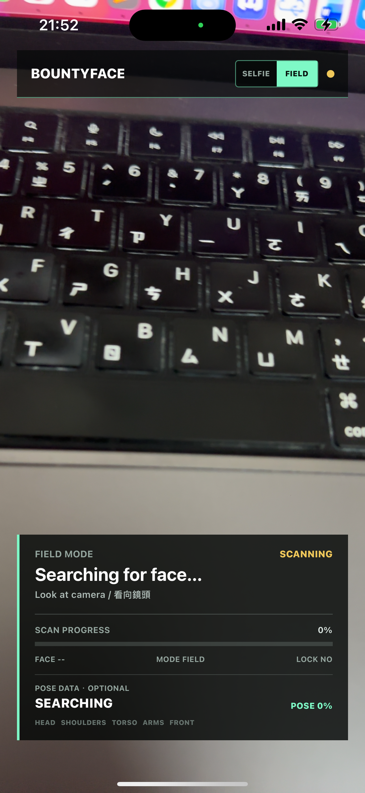
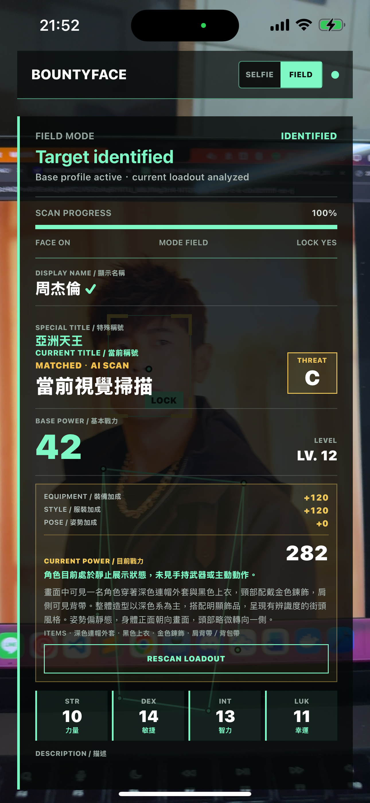
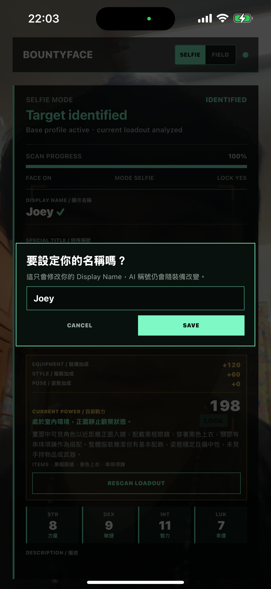

# BountyFace User Guide / 使用手冊

[English](#english) | [繁體中文](#繁體中文)

---

## English

### What is BountyFace?

BountyFace is a cyberpunk RPG scanner. Point your iPhone camera at someone and the
app generates a fictional RPG character card — complete with stats, threat level,
power rating, and a dynamic title based on what they're wearing and how they stand.

### Getting Started

1. **Open the app** — The camera starts immediately in Field Mode.
2. **Point at a face** — Hold steady until the scanning frame turns green and locks.
3. **Scan completes** — The app matches the face or creates a new character.
4. **View results** — A profile card appears with base stats and current scan data.

### Scan Modes

| Mode | Use When | Display Name | Editable? |
|------|----------|-------------|-----------|
| **Selfie** | Scanning yourself | 匿名 | Yes |
| **Field** | Scanning someone else | 匿名目標 | No |

Switch modes using the **SELFIE / FIELD** buttons at the top of the screen.

### Understanding the Screen

#### Camera View

- **Scanning frame** — The green/white box around the detected face.
- **Guidance text** — Prompts at the top tell you what to do:
  - `Look at camera / 看向鏡頭` — No face detected
  - `Hold still / 保持不動` — Face found, stay still
  - `Face the camera / 請面對鏡頭` — Turn toward the camera
  - `Identity ready / 身份鎖定` — Face locked, analyzing

  

#### Profile Card (after scan completes)

| Section | What It Shows |
|---------|--------------|
| **DISPLAY NAME** | Your chosen name (Selfie) or auto-assigned (Field) |
| **SPECIAL TITLE** | Admin-granted title (green, only if assigned) |
| **CURRENT TITLE** | AI-generated title based on current outfit and pose |
| **THREAT** | Threat level: D / C / B / A / S / SS |
| **BASE POWER** | Permanent base combat power |
| **LEVEL** | Character level (LV. 1–100) |
| **STATS** | STR / DEX / INT / LUK (1–100 each) |
| **CURRENT POWER** | Base power + equipment + style + pose bonuses |
| **EQUIPMENT** | Bonus from visible gear |
| **STYLE** | Bonus from clothing coordination |
| **POSE** | Bonus from stance and posture |
| **ITEMS** | Detected visible items |
| **STATUS** | Current combat status description |

### Possible Match

If the app finds a similar face, it shows a **POSSIBLE MATCH** panel:

- **CONFIRM** — This IS the same person. Adds their new look to the profile.
- **CREATE NEW** — This is a different person. Creates a new character.

### Changing Your Display Name (Selfie Mode Only)

1. Scan yourself in **Selfie Mode**.
2. After the profile card appears, tap **EDIT** next to your display name.
3. Enter your new name and tap **SAVE**.

> Only selfie-created characters can be renamed. Field scans and public figures cannot.

### Rescan Loadout

Tap **RESCAN LOADOUT** to analyze the current appearance again. Base stats stay the
same — only the current title, equipment, style, pose, and power bonus are recalculated.

### Verified Badge

A green ✓ next to the display name means this is a verified official profile
maintained by an admin — not AI-generated and not user-declared.

---

## 繁體中文

### BountyFace 是什麼？

BountyFace 是一款賽博龐克 RPG 掃描器。將 iPhone 鏡頭對準人物，App 會即時產生
一張虛構的 RPG 角色卡 — 包含能力值、威脅等級、戰力數值，以及根據穿著和姿勢
生成的動態稱號。

### 快速上手

1. **打開 App** — 相機預設為 Field Mode（現場模式）。
2. **對準臉部** — 保持穩定，直到掃描框變綠並鎖定。
3. **掃描完成** — App 會自動比對身份或建立新角色。
4. **查看結果** — 角色卡顯示基本數值與本次掃描結果。

### 掃描模式

| 模式 | 用途 | 顯示名稱 | 可修改？ |
|------|------|----------|----------|
| **Selfie** | 掃描自己 | 匿名 | ✅ 可以 |
| **Field** | 掃描他人 | 匿名目標 | ❌ 不行 |

點擊畫面上方的 **SELFIE / FIELD** 按鈕切換模式。

### 畫面說明

#### 相機畫面

- **掃描框** — 偵測到臉部後的綠色 / 白色框線。
- **引導提示** — 上方的文字會告訴你下一步：
  - `Look at camera / 看向鏡頭` — 尚未偵測到臉
  - `Hold still / 保持不動` — 已偵測到臉，請保持穩定
  - `Face the camera / 請面對鏡頭` — 臉部角度太偏，請轉正
  - `Identity ready / 身份鎖定` — 臉部已鎖定，正在分析

#### 角色卡（掃描完成後）

| 區塊 | 顯示內容 |
|------|----------|
| **DISPLAY NAME / 顯示名稱** | 你設定的名稱（Selfie）或自動分配（Field） |
| **SPECIAL TITLE / 特殊稱號** | 管理員授予的稱號（綠色，僅有設定時顯示） |
| **CURRENT TITLE / 當前稱號** | AI 根據當下服裝與姿勢產生的稱號 |
| **THREAT** | 威脅等級：D / C / B / A / S / SS |
| **BASE POWER / 基本戰力** | 永久基本戰鬥力 |
| **LEVEL** | 角色等級（LV. 1–100） |
| **STATS / 能力值** | STR / DEX / INT / LUK（各 1–100） |
| **CURRENT POWER / 目前戰力** | 基本戰力 + 裝備 + 服裝 + 姿勢加成 |
| **EQUIPMENT / 裝備加成** | 根據可見裝備計算 |
| **STYLE / 服裝加成** | 根據服裝協調度計算 |
| **POSE / 姿勢加成** | 根據站姿與動作計算 |
| **ITEMS** | 偵測到的可見物品 |
| **STATUS** | 當前戰鬥狀態描述 |

### Possible Match / 可能匹配

當 App 發現相似臉部時，會顯示 **POSSIBLE MATCH** 面板：

- **CONFIRM** — 確認是同一人，將新的外觀加入該角色。
- **CREATE NEW** — 建立一個全新的角色。

### 修改顯示名稱（僅限 Selfie Mode）

1. 在 Selfie Mode 掃描自己。
2. 角色卡出現後，點 **EDIT** 按鈕。
3. 輸入新名稱，點 **SAVE**。

> 只有 Selfie 模式建立的角色可以改名。Field 掃描和官方角色無法修改。

### 重新掃描（Rescan Loadout）

點擊 **RESCAN LOADOUT** 可重新分析當前外觀。基本數值不變，只更新稱號、裝備、
服裝、姿勢加成與目前戰力。

### 已驗證標章

顯示名稱旁的綠色 ✓ 代表這是管理員確認的官方角色 — 不是 AI 自動產生的，
也不是使用者自己宣告的。
